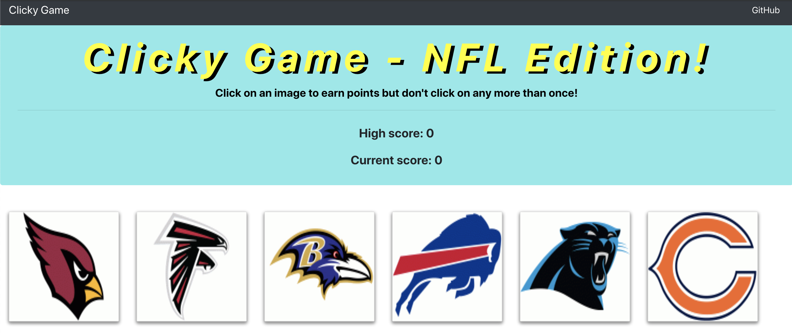

# Memory Game - NFL Edition

The memory game is an NFL themed game that tests your ability to recognize the logos of NFL teams when the 
tiles are constantly being shuffled. This purpose of this assignment was to learn how to use React.js to render
components, specifically components that can loop through an array of data and be formatted similarly to reduce
the amount of repetitive code.

Languages and Tools:
HTML, CSS, Javascript, React.js, Heroku, Bootstrap

How to play!: 
1) Click on the deployed heroku link provided below!
2) Click any of the tiles to start the game
    - If the tile has not been clicked on you will be rewarded one point, and the tiles will be shuffled randomly
    - If the tile has been clicked on during that round, you lose!
3) Upon a loss a users current score will be reset, and scores will be only recorded if you beat your high score.

Play the deployed version: [Heroku App](https://memory-game-0.herokuapp.com/)
Link to the github repo: [GitHub Repo](https://github.com/nguyenj0215/Memory-Game)